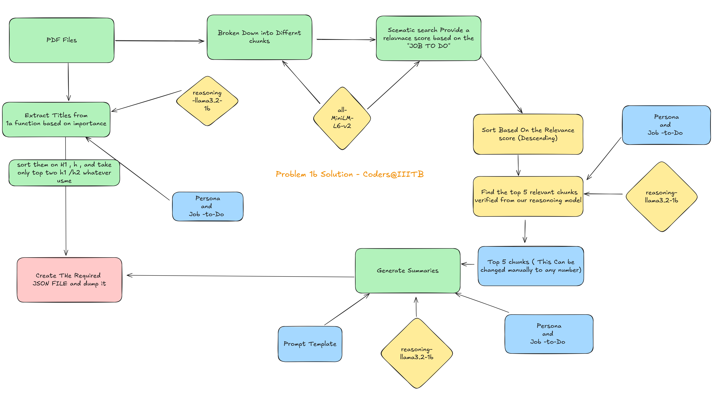

# **Our Solution To Problem 1b**

### Abstract

This document outlines the architecture and design philosophy behind our solution for the **Round 1B: Persona-Driven Document Intelligence** challenge. Our system is not merely a pipeline; it's the outcome of a rigorous journey of iterative design, marked by numerous failures, which ultimately led to a hybrid approach that excels under extreme constraints.

---

## **1. The Challenge: Intelligence Under Pressure**

The mission was to build an intelligent document analyst capable of extracting and prioritizing information from diverse documents, tailored to a specific user persona and their "job-to-be-done."

The core challenge lay in the constraints:

> * **CPU Only**

> * **Model Size ≤ 1GB**

> * **Processing Time ≤ 60 seconds**

> * **No Internet Access Allowed During Execution**

---

## **2. Our Idea: Verification Over Blind Trust**

Our journey taught us one critical lesson: small language models are poor at complex reasoning and scoring tasks. They cannot be trusted to "rank" documents reliably. Instead of forcing a model to do a job it's bad at, we built our system on a new philosophy:

> **"Use semantic search for what it's good at—finding possibilities. Use a reasoning engine for what *we* need—verifying truth."**

This led us to a unique architecture designed for **speed, precision, and robustness.**

---

## **3. The Final Architecture: A Multi-Stage Gauntlet**

We subject every piece of data to a rigorous gauntlet. Only the most relevant information survives, which is then formatted for the final output.

### **Stage 1: Broad Semantic Search** 🔍

This is the initial, wide-net approach to find potentially relevant content.

* **What it is:** A standard bi-encoder model that converts the user's query and all document chunks into vectors.
* **Why it's used:** It's incredibly fast at creating a large pool of candidates based on conceptual similarity. It answers the question: "Which parts of these documents are *about* the same topic?"
* **Technology Used:**`all-MiniLM-L6-v2` embedding model with cosine similarity calculation.

### **Stage 2: Instant Keyword Elimination** ⚡

This is our first unique optimization, designed for hyper-speed elimination to make the process more efficient and fast.

* **What it is:** A rule-based, instantaneous filter that scans candidate chunks for "banned" words based on the job-to-be-done.
* **Why it's used:** Semantic search alone cannot handle hard constraints like "vegetarian" and will often rank text about "chicken dinner" highly. This filter immediately discards any chunk with obvious contradictions before wasting any time on deeper analysis.

### **Stage 3: LLM-Powered Relevance Verification** 🧠

This is our secret weapon and the core of our unique solution. We don't ask the LLM to rank or score; we give it a simpler, more powerful job.

* **What it is:** A small, specialized reasoning LLM that receives a single, pre-vetted chunk and the user's query. Its only job is to answer one question: **"Is this content *truly* and *strictly* relevant to this task? Answer YES or NO."**
* **Why it's used:** This plays to the LLM's strengths in generation while avoiding its weakness in complex reasoning. It performs a final, brutal interrogation of the content's relevance. After trying and failing with other models, we found the `reasoning-llama-3.2-1b` model was uniquely capable of this strict verification task.
* **Technology Used:**`reasoning-llama-3.2-1b` model executed via `llama-cpp-python` with a highly structured prompt.

### **Stage 4: Title Extraction & Summarization** ✍️

Once a chunk has survived the gauntlet, it's processed for the final output.

* **What it is:** For each verified chunk, we use our reasoning LLM to perform two final, simple generative tasks: creating a concise summary and extracting a human-readable `section_title`.
* **Why it's used:** This fulfills the challenge's required output format and makes the final JSON report easy to understand. By reusing the already-loaded `reasoning-llama-3.2-1b`, we remain efficient and avoid loading another model.
* **Technology Used:**`reasoning-llama-3.2-1b` with specific prompts for summarization and title generation.

---

## **4. The Journey: A Chronicle of Failed Attempts**

Our final architecture was forged in the fire of experimentation.

| Attempt | Approach | Problem / Why It Failed | Key Learning |

| :--- | :--- | :--- | :--- |

|**#1**|**Naive MVP**| Used **TinyLlama** for summaries due to its small size, but it generated disjointed, out-of-context text. Ranking was poor and generic. | A simple summarizer isn't intelligent, and basic semantic search lacks nuance. |

|**#2**|**Pure LLM**| Incredibly slow, brittle, and the LLM was incapable of performing basic scoring or reasoning tasks. | A small LLM cannot "think" or reason reliably; it's a pattern-matcher. |

|**#3**|**Hybrid: LLM Re-Ranker**| The LLM was still not capable of the ranking task, even with advanced prompting. | You cannot force a tool to do something it's fundamentally bad at. |

|**#4**|**LLM Keyword Extractor**| The LLM was not reliable enough to extract keywords, creating a bottleneck that broke the entire pipeline. | A pipeline is only as strong as its least capable component. |

|**#5**|**Optimized Summarizer**| We optimized the speed of summarization, which was useless because the content being summarized was completely irrelevant. | Do not optimize a process until its core function is correct. Fix relevance before speed. |

|**#6**|**Gemma 3 Switch**| Switched to a modern `gemma-3-1b-it` model. It failed the relevance check, for example, by **suggesting non-vegetarian items for a vegetarian dish query.**| Even modern small models struggle with reasoning. A specialized reasoning model was needed. |

|**#7**|**Final Reasoning Switch**| Deeply analyzing every top-ranked chunk from the semantic search took too much time, as many were still irrelevant. | A hybrid filter is key. Our **Instant Eliminator** cheaply removes most junk, letting the final **Reasoning LLM** focus its expensive analysis on only the most promising chunks. |

---

## **5. Why Our Solution Is Uniquely Effective**

Our multi-stage gauntlet provides a solution that is greater than the sum of its parts.

* **✅ Unmatched Precision:** By using a reasoning LLM for **verification, not ranking**, we eliminate the "generic but irrelevant" results that plague purely semantic systems.
* **✅ Blazing Speed:** The **Instant Eliminator** removes a huge number of irrelevant chunks without any LLM overhead, allowing the pipeline to focus its intelligence only on the most promising candidates.
* **✅ Extreme Efficiency:** Our entire workflow is designed around small, specialized models, easily meeting the `<1GB` and `CPU-only` constraints.
* **✅ Robust and Reliable:** Each component does one job and does it exceptionally well. This avoids the brittle, unpredictable behavior of asking one model to do everything.
